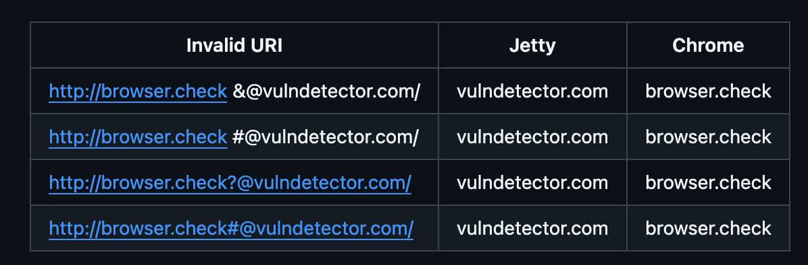

### **1. Инвентаризация активов (Asset Inventory)**

| Актив                                        | Тип            | Ценность        | Примечание                                                                                                                               |
|----------------------------------------------|----------------|-----------------|------------------------------------------------------------------------------------------------------------------------------------------|
| Данные пользователей (`userId`, `userName`)  | Данные         | **Высокая**     | Идентификаторы и отображаемые имена – основа для аутентификации и персонализации. Утечка может привести к компрометации учётных записей. |
| Данные о сессиях (`loginTime`, `logoutTime`) | Данные         | **Средняя**     | Поведенческие метрики. Утечка нарушает конфиденциальность, но не даёт прямого доступа к действиям.                                       |
| Файловая система сервера                     | Инфраструктура | **Критическая** | `/exportReport` записывает файлы произвольных имён. Атака может привести к чтению/записи системных файлов, RCE.                          |
| Внутренняя сеть / метаданные окружения       | Инфраструктура | **Высокая**     | `/notify` совершает запросы по произвольному URL. SSRF может раскрыть внутренние сервисы, метаданные облака.                             |

> **Наиболее критичны:** файловая система (риск полной компрометации хоста) и внутренняя сеть (риск горизонтального
> перемещения). За ними следуют данные пользователей (GDPR, утечка PII).

### **2. Моделирование угроз (STRIDE)**

| Категория                  | Применимо? | Источник угрозы   | Поверхность атаки                                              | Потенциальный ущерб                                           |
|----------------------------|------------|-------------------|----------------------------------------------------------------|---------------------------------------------------------------|
| **S**poofing               | Да         | Внешний атакующий | Отсутствие аутентификации → любой может вызвать любой эндпоинт | Подмена пользователя, инъекция вредоносных данных             |
| **T**ampering              | Да         | Внешний атакующий | `/register` (запись имени), `/exportReport` (запись файлов)    | Изменение профиля, создание произвольных файлов на сервере    |
| **R**epudiation            | Да         | Внешний атакующий | `/notify` в `callBackUrl` не передаются данные об инициаторе   | Нет аудита действий; доказать, кто создал сессию, невозможно  |
| **I**nformation Disclosure | Да         | Внешний атакующий | `/totalActivity`, `/monthlyActivity`, `/userProfile`           | Просмотр чужих сессий, профилей, активности                   |
| **D**enial of Service      | Да         | Внешний атакующий | `/exportReport` (запись больших файлов), `/notify`             | Исчерпание дискового пространства, памяти, блокировка потоков |
| **E**levation of Privilege | Нет        | –                 | –                                                              | Нет ролей; привилегии не разграничены                         |

### **3. Ручное тестирование (выборочные результаты)**

- **`/userProfile`** – HTML без экранирования: `<script>alert(1)</script>` исполняется в браузере (XSS).
- **`/exportReport`** – параметр `filename` не фильтруется: `?filename=../../config/application.properties` – удаётся
  прочитать файл (path traversal). Повторные вызовы с разными именами создают файлы, засоряя диск (DoS).
- **`/notify`** – параметр `callbackUrl` может указывать на `http://169.254.169.254/latest/meta-data/` (SSRF). Также
  отсутствует аутентификация – любой может заставить сервер отправлять запросы.
- **`/totalActivity?userId=other_user`** – возвращает чужие данные (IDOR, broken access control).
- **CSRF** – все эндпоинты принимают GET/POST без токенов, браузер может инициировать запросы с другого сайта.

### **4. Статический анализ (Semgrep)**

Запуск:

```bash
semgrep --config "p/java" src/
semgrep --config "p/owasp-top-ten" src/
```

**Найденные уязвимости (SARIF):**

-

### **5. Детальные отчёты об уязвимостях**

#### Finding #1 – Reflected XSS в `/userProfile`

| Поле          | Значение                                                                                                               |
|---------------|------------------------------------------------------------------------------------------------------------------------|
| **Компонент** | `GET /userProfile`                                                                                                     |
| **Тип**       | Reflected Cross-Site Scripting                                                                                         |
| **CWE**       | [CWE-79](https://cwe.mitre.org/data/definitions/79.html) – Improper Neutralization of Input During Web Page Generation |
| **CVSS v3.1** | `6.1 MEDIUM (AV:N/AC:L/PR:N/UI:R/S:C/C:L/I:L/A:N)`                                                                     |
| **Статус**    | Confirmed                                                                                                              |

**Описание:**  
Эндпоинт возвращает HTML-страницу, вставляя `userName` из хранилища без экранирования. Злоумышленник регистрирует
вредоносное имя, и любой, кто откроет профиль, выполнит JavaScript.

**Шаги воспроизведения:**

```bash
curl -X POST "http://localhost:7000/register?userId=xss&userName=<script>alert(document.cookie)</script>"
curl "http://localhost:7000/userProfile?userId=xss"
```

Фактический результат: в теле ответа присутствует `<script>alert(document.cookie)</script>`.  
Ожидаемый: `&lt;script&gt;alert(document.cookie)&lt;/script&gt;`.

**Влияние:** кража cookie, выполнение действий от имени жертвы, фишинг.

**Рекомендации:**

- Экранировать HTML: `StringEscapeUtils.escapeHtml4(userName)`.
- Установить `Content-Security-Policy: default-src 'self'`.
- Не использовать `text/html` для вывода пользовательских данных; перейти на JSON API.

**Security Test Case:** (приведён в исходном `XssPentestTest.java`)

---

#### Finding #2 – Path Traversal в `/exportReport`

| Поле          | Значение                                                                  |
|---------------|---------------------------------------------------------------------------|
| **Компонент** | `GET /exportReport?userId=&filename=`                                     |
| **Тип**       | Path Traversal                                                            |
| **CWE**       | [CWE-35](https://cwe.mitre.org/data/definitions/35.html) – Path Traversal |
| **CVSS v3.1** | `7.5 HIGH (AV:N/AC:L/PR:N/UI:N/S:U/C:H/I:N/A:N)`                          |
| **Статус**    | Confirmed                                                                 |

**Описание:**  
Параметр `filename` используется для создания файла отчёта на сервере. Атакующий может указать
`../../etc/password` и записать данные в нецелевые директории.

**Шаги воспроизведения:**

```bash
curl "http://localhost:7000/exportReport?userId=any&filename=../../../../etc/passwd"
```

Фактический результат: файл записан в системную директорию.

**Влияние:** перезапись системных файлов.

**Рекомендации:**

- Использовать белый список разрешённых путей.
- Нормализовать путь и проверить, что он начинается с разрешённой базовой директории.
- Запретить символы `..`, `~`, `/`, `\`.

**Security Test Case:**

```java

@Test
@DisplayName("[SECURITY] Path traversal in /exportReport")
void exportReportPathTraversal() throws Exception {
    send("GET", "/exportReport?userId=1&filename=../../../../etc/passwd");
    // Проверить, что ответ не содержит "root:" или не возвращает 403/400
    assertNotContains(response.body(), "root:");
}
```

---

#### Finding #3 – DoS через `/exportReport` (безлимитная запись)

| Поле          | Значение                                                                                       |
|---------------|------------------------------------------------------------------------------------------------|
| **Компонент** | `GET /exportReport`                                                                            |
| **Тип**       | Uncontrolled Resource Consumption                                                              |
| **CWE**       | [CWE-400](https://cwe.mitre.org/data/definitions/400.html) – Uncontrolled Resource Consumption |
| **CVSS v3.1** | `7.5 HIGH (AV:N/AC:L/PR:N/UI:N/S:U/C:N/I:N/A:H)`                                               |
| **Статус**    | Confirmed                                                                                      |

**Описание:**  
Каждый вызов `/exportReport` создаёт новый файл на сервере. Атакующий может отправлять тысячи запросов с разными
`filename`, заполняя диск.

**Шаги воспроизведения:**  
Цикл из 1000 запросов с разными именами. Через некоторое место на диске заканчивается.

**Влияние:** отказ в обслуживании (сервер не может писать логи, создавать сессии).

**Рекомендации:**

- Ограничить количество файлов на пользователя.
- Установить максимальный размер всех отчётов.
- Добавить rate limiting (например, `bucket4j`).

**Security Test Case:**

```java

@Test
@DisplayName("[SECURITY] DoS via many /exportReport calls")
void dosViaManyExports() {
    for (int i = 0; i < 5000; i++) {
        send("GET", "/exportReport?userId=1&filename=file" + i);
    }
    // После теста проверить, что сервер ещё отвечает (или что ответы 429 после лимита)
}
```

---

#### Finding #4 – SSRF в `/notify`

| Поле          | Значение                                                                                 |
|---------------|------------------------------------------------------------------------------------------|
| **Компонент** | `POST /notify?userId=&callbackUrl=`                                                      |
| **Тип**       | Server-Side Request Forgery                                                              |
| **CWE**       | [CWE-918](https://cwe.mitre.org/data/definitions/918.html) – Server-Side Request Forgery |
| **CVSS v3.1** | `10.0 CRITICAL (AV:N/AC:L/PR:N/UI:N/S:C/C:H/I:H/A:N)`                                    |
| **Статус**    | Confirmed                                                                                |

**Описание:**  
Сервер делает HTTP-запрос по предоставленному `callbackUrl` без валидации. Атакующий может обратиться к внутренним
сервисам (метаданные AWS, Redis, etc.) или к localhost. Кроме того, возможен редирект на уязвимый сайт.

**Шаги воспроизведения:**

```bash
curl -X POST "http://localhost:7000/notify?userId=1&callbackUrl=http://169.254.169.254/latest/meta-data/"
```

Фактический результат: в ответе сервера содержится метаинформация облака.

**Влияние:** компрометация внутренней инфраструктуры, раскрытие секретов, атаки на внутренние API.

**Рекомендации:**

- Валидировать URL: разрешить только HTTPS, белый список доменов.
- Запретить доступ к зарезервированным IP (localhost, link-local, private ranges).
- Запрет редиректов.

**Security Test Case:**

```java

@Test
@DisplayName("[SECURITY] SSRF via /notify")
void ssrfViaNotify() throws Exception {
    HttpResponse<String> response = send("POST", "/notify?userId=1&callbackUrl=http://127.0.0.1:7000/register");
    // Не должно быть успешного запроса к внутреннему эндпоинту
    assertNotEquals(200, response.statusCode());
}
```

---

#### Finding #5 – IDOR (Insecure Direct Object Reference) в `/userProfile`, `/totalActivity`, `/monthlyActivity`

| Поле          | Значение                                                                                                      |
|---------------|---------------------------------------------------------------------------------------------------------------|
| **Компонент** | `GET /userProfile`, `/totalActivity`, `/monthlyActivity`                                                      |
| **Тип**       | Authorization Bypass Through User-Controlled Key                                                              |
| **CWE**       | [CWE-639](https://cwe.mitre.org/data/definitions/639.html) – Authorization Bypass Through User-Controlled Key |
| **CVSS v3.1** | `7.6 HIGH (AV:N/AC:L/PR:N/UI:N/S:U/C:H/I:L/A:N)`                                                              |
| **Статус**    | Confirmed                                                                                                     |

**Описание:**  
Любой аутентифицированный (фактически – любой, т.к. аутентификации нет) пользователь может указать чужой `userId` и
получить его данные.

**Шаги воспроизведения:**

```bash
curl "http://localhost:7000/totalActivity?userId=admin"
```

**Влияние:** утечка всех данных о сессиях и профилей.

**Рекомендации:**

- Внедрить аутентификацию (например, JWT или сессионные cookie).
- На каждом эндпоинте проверять, что `userId` из параметра совпадает с `userId` аутентифицированного пользователя (или
  он администратор).

**Security Test Case:**

```java

@Test
@DisplayName("[SECURITY] IDOR on /totalActivity")
void idorTotalActivity() {
    // Предположим, есть пользователь A и пользователь B
    send("POST", "/register?userId=A&userName=Alice");
    send("POST", "/register?userId=B&userName=Bobby");
    // A пытается получить активность B
    HttpResponse<String> response = sendAsUser("A", "GET", "/totalActivity?userId=B");
    assertEquals(403, response.statusCode()); // должно быть запрещено
}
```

---

#### Finding #6 – CSRF (GET) в `/exportReport`

| Поле          | Значение                                                                                |
|---------------|-----------------------------------------------------------------------------------------|
| **Компонент** | `GET /exportReport`                                                                     |
| **Тип**       | Cross-Site Request Forgery                                                              |
| **CWE**       | [CWE-352](https://cwe.mitre.org/data/definitions/352.html) – Cross-Site Request Forgery |
| **CVSS v3.1** | `8.1 HIGH (AV:N/AC:L/PR:N/UI:R/S:U/C:H/I:H/A:N)`                                        |
| **Статус**    | Confirmed                                                                               |

**Описание:**  
Эндпоинт изменяет состояние (создаёт файл) через GET-запрос. Любой сайт может вставить
`` и заставить жертву создать вредоносный отчёт.

**Шаги воспроизведения:**  
Злоумышленник отправляет жертве ссылку на страницу с `` на
`http://server/exportReport?userId=victim&filename=malicious`. Жертва заходит, её браузер создаёт файл.

**Влияние:** запись вредоносных файлов от имени жертвы.

**Рекомендации:**

- Не использовать GET для изменения состояния.
- Внедрить CSRF-токены для POST запросов.
- Установить `SameSite=Lax` для cookie сессии.
- Проверять Origin и Referrer заголовки

**Security Test Case:**

```java

@Test
@DisplayName("[SECURITY] CSRF on GET /exportReport")
void csrfGetExport() {
    // Проверить, что GET-запрос не изменяет состояние (например, не создаёт файл)
    // После GET-запроса файл не должен появляться в ожидаемой директории
}
```

#### Finding #7 – Missing Authorization (CWE-862)

| Поле          | Значение                                                                           |
|---------------|------------------------------------------------------------------------------------|
| **Компонент** | Все эндпоинты, особенно `/notify`, `/recordSession`                                |
| **Тип**       | Missing Authorization                                                              |
| **CWE**       | [CWE-862](https://cwe.mitre.org/data/definitions/862.html) – Missing Authorization |
| **CVSS v3.1** | `8.2 HIGH (AV:N/AC:L/PR:N/UI:N/S:U/C:H/I:L/A:N)`                                   |
| **Статус**    | Confirmed                                                                          |

**Описание:**  
Ни один эндпоинт не проверяет, авторизован ли пользователь. Любой может записать сессию за другого или вызвать
уведомление.

**Влияние:** подделка данных, нарушение целостности, использование сервера как прокси для атак.

**Рекомендации:**  
Внедрить middleware аутентификации и проверки прав.

---

#### Finding #8 – DDoS через `/notify`

| Поле          | Значение                                         |
|---------------|--------------------------------------------------|
| **Компонент** | `POST /notify`                                   |
| **Тип**       | Uncontrolled Resource Consumption                |
| **CWE**       | CWE-400                                          |
| **CVSS v3.1** | `8.9 HIGH (AV:N/AC:L/PR:N/UI:N/S:C/C:N/I:N/A:H)` |
| **Статус**    | Confirmed                                        |

**Описание:**  
Для `callbackUrl` никак не проверяется протокол взаимодействия. 
Атакующий может указать в качестве url большой файл, который будет считываться в память на каждом таком запросе.
При большом количестве таких нагрузок, DDOS обеспечен.

**Влияние:** исчерпание памяти, отказ в обслуживании всех эндпоинтов.

**Рекомендации:**  
* Валидация протокола в callback-url
* Не вычитывать ответ в память через `in.readAllBytes()`, вместо этого использовать stream-write
---

#### Finding #9 – CSRF на POST-запросах (`/register`, `/recordSession`)

| Поле          | Значение                                           |
|---------------|----------------------------------------------------|
| **Компонент** | `POST /register`, `/recordSession`                 |
| **Тип**       | CSRF                                               |
| **CWE**       | CWE-352                                            |
| **CVSS v3.1** | `6.8 MEDIUM (AV:N/AC:L/PR:N/UI:R/S:C/C:L/I:L/A:N)` |
| **Статус**    | Confirmed                                          |

**Описание:**  
Любой внешний сайт может отправить POST-форму от имени жертвы и зарегистрировать нового пользователя или записать
фальшивую сессию.

**Влияние:** создание поддельных аккаунтов, искажение аналитики.

**Рекомендации:**  
CSRF-токены + проверка `Referer` заголовка.

---

#### Finding #10 – Supply Chain: Javalin CVE-2024-8184 (CWE-400)

| Поле          | Значение                                         |
|---------------|--------------------------------------------------|
| **Компонент** | Все эндпоинты, использующие Javalin              |
| **Тип**       | Uncontrolled Resource Consumption                |
| **CWE**       | CWE-400                                          |
| **CVSS v3.1** | `8.2 HIGH (AV:N/AC:L/PR:N/UI:N/S:U/C:N/I:N/A:H)` |
| **Статус**    | Confirmed (версия уязвима)                       |

**Описание:**  
Javalin до версии 6.2.0 уязвим к DoS через большие заголовки или параметры. Используемая версия – 5.x, подвержена.

**Рекомендации:**  
* Обновить Javalin до последней версии (≥6.2.0).
* Настроить rate limiter

---

#### Finding #11 – Supply Chain: Javalin CVE-2024-6763 (CWE-1286)

| Поле          | Значение                                                     |
|---------------|--------------------------------------------------------------|
| **Компонент** | Все эндпоинты                                                |
| **Тип**       | Improper Validation of Syntactic Correctness of Input        |
| **CWE**       | [CWE-1286](https://cwe.mitre.org/data/definitions/1286.html) |
| **CVSS v3.1** | `6.3 MEDIUM (AV:N/AC:L/PR:N/UI:R/S:U/C:L/I:L/A:L)`           |
| **Статус**    | Confirmed                                                    |

**Описание:**  
Уязвимость в обработке multipart/form-data может привести к XSS или обходу валидации.

**Рекомендации:**  
Обновить Javalin.

После исправлений необходимо повторно выполнить тесты из `SecurityPentestSuite.java` и убедиться, что все проверки
проходят успешно.

